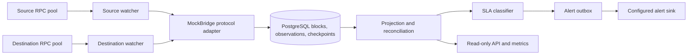

# BridgeWatch

Cross-chain delivery monitoring in Go.

BridgeWatch observes a configured source chain and destination chain independently. It records source messages, waits for source finality, opens a relay expectation, correlates destination execution, and classifies delayed delivery as `STUCK` only while both watchers have healthy current evidence. Bounded reorgs recompute message state, including withdrawal of `COMPLETED`; duplicate or conflicting executions block completion. PostgreSQL checkpoints and retained observations make catch-up and restart repeatable.

Multiple RPC endpoints per chain provide bounded failover. Each endpoint is checked against the configured chain and genesis anchor. Cross-provider header disagreement degrades readiness without a provider vote. A deep divergence beyond the automatic bound requires the explicit `reconcile-chain` procedure.

## Run the local demonstration

```sh
make demo
```

The command builds the MockBridge fixtures, starts isolated PostgreSQL 18.6 and two Anvil 1.8.5 chains (`31337` and `31338`), and checks the full scenario. It writes machine-readable results to `out/phase5/demo.json`. `make benchmark` performs three correctness-gated local workload runs and writes raw results and a median summary to `out/phase5/`. These are local fixture results, not service-level promises.

`make verify-phase5` runs the inherited test, race, migration, and two-chain gates, then the demo, benchmark smoke, build and scanner checks. `make clean-clone-verify` repeats core gates from `git archive HEAD` in a temporary directory. Go 1.27.1, Python 3, PostgreSQL 18.6 command-line tools, Ruby, `curl`, Docker, Syft, and Trivy are required for the complete final gate. The verifier uses installed Foundry 1.8.5 or downloads the official archive and checks its published SHA-256.

## Architecture



The [specification](SPEC.md), [architecture](docs/architecture.md), [schema](docs/schema.md), [failure matrix](docs/failure-matrix.md), [threat model](docs/threat-model.md), [test strategy](docs/testing.md), [evidence map](docs/evidence.md), [demo](docs/demo.md), [benchmark](docs/benchmark.md), and [ADRs](docs/adr/) describe the implementation and limits. The [OpenAPI contract](api/openapi.yaml) defines read-only routes.

## Configuration and recovery

The service requires explicit database, chain, contract, genesis, start block, confirmation, reorg depth, SLA, and policy version settings. See [demo configuration](docs/demo.md). `BRIDGEWATCH_SOURCE_RPC_ENDPOINTS` and `BRIDGEWATCH_DESTINATION_RPC_ENDPOINTS` accept comma-separated `id=http-url` entries (maximum eight per chain); the legacy single `BRIDGEWATCH_SOURCE_RPC_URL` and `BRIDGEWATCH_DESTINATION_RPC_URL` remain supported. Endpoint IDs are bounded metric labels; credential-bearing URLs are excluded from diagnostics and telemetry. The API binds to `127.0.0.1:8080` by default, and the container sets `:8080`.

After `MANUAL_INTERVENTION`, stop the service and follow the [recovery procedure](docs/recovery.md). The command is a dry run unless `--execute` is supplied. It validates the configured chain and anchor, selected endpoint, exact persisted checkpoint, chosen canonical ancestor, and retained ancestry before changing canonical flags. Restart the service to replay the selected branch. Historical observations, transitions, anomaly episodes, and alerts remain stored.

## Trust boundary

Configured RPC providers are trusted observation sources. Multiple endpoints improve availability and visibility; they do not establish consensus or prove log completeness. MockBridge is a deterministic fixture, not a validator or custody bridge. BridgeWatch does not submit transactions, prove bridge economic security, or guarantee delivery. Alert delivery is at least once. There is no production history or independent audit.

## License

Apache-2.0. See [LICENSE](LICENSE).
