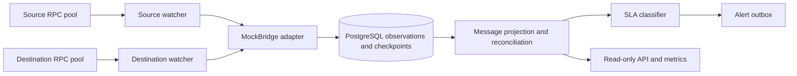

# BridgeWatch

BridgeWatch checks whether a message sent through a bridge was actually executed on the destination chain.

A source transaction can succeed while delivery is delayed, duplicated, or never completed. Both chains can also reorganize, and an RPC provider can miss data or fail midway through a scan. BridgeWatch follows each chain independently, matches source messages to destination executions, and keeps a durable account of what it has seen. This repository demonstrates the monitoring and recovery work behind a useful bridge status, using a deterministic MockBridge rather than a live custody bridge.

## How it works



The source watcher records a message before the destination watcher can claim its execution. Each watcher advances from a durable checkpoint and applies its own confirmation policy. The projection can withdraw a previous `COMPLETED` result after a bounded reorganization. A message becomes `STUCK` only when its deadline has passed **and** both watchers have current, healthy evidence; an unavailable provider is not evidence of non-delivery.

## Engineering focus

| Problem | Design and resulting behavior |
| --- | --- |
| A destination event can claim an unrelated message ID. | The adapter accepts source identity only from the configured source contract and correlates destination evidence to it; a destination event alone cannot create a valid source message. |
| Chain history can change after an apparent completion. | Block ancestry and retained observations drive a recomputed projection; bounded reorgs can revoke completion without deleting the earlier observation. |
| A restart can interrupt either watcher. | PostgreSQL stores observations and checkpoints; catch-up resumes from the committed position instead of relying on process memory. |
| An RPC endpoint can fail or disagree with another. | Endpoints are checked against chain identity and the configured anchor. Disagreement degrades readiness; it is not resolved by a provider vote. |
| An overdue message may simply be hidden by unhealthy watchers. | SLA classification requires fresh evidence on both chains before emitting a stuck alert. |
| A deep fork exceeds retained automatic recovery. | Progress stops for the explicit `reconcile-chain` procedure, which validates the selected ancestor before changing canonical flags. |

The [failure matrix](docs/failure-matrix.md) and [architecture](docs/architecture.md) give the exact state and trust boundaries.

## Quick start

Prerequisites for the local demonstration: Go 1.27.1, Python 3, PostgreSQL 18 server tools, Docker, and Foundry (`anvil`, `forge`, `cast`). The demo starts disposable local chains and PostgreSQL; no public RPC credentials are needed.

```sh
git clone <repository-url> BridgeWatch
cd BridgeWatch
go mod download
make demo
go test ./...
```

`make demo` builds the MockBridge fixture, starts two Anvil chains and PostgreSQL, then checks source finality, delivery, delay, reorg, and recovery behavior. It writes local machine-readable results to `out/phase5/demo.json`. See [demo steps](docs/demo.md).

For the complete local gate, install the additional tools listed in [testing](docs/testing.md), including Ruby, `curl`, Syft, and Trivy, then run `make verify-phase5`. This gate covers Go tests and race checks, migrations, two-chain scenarios, the demo, a benchmark smoke run, build, and scanning. `make clean-clone-verify` also replays core checks from a temporary export of the committed tree.

## Local benchmark

`make benchmark` runs three correctness-gated local workloads and writes raw runs and a median summary under `out/phase5/`. The [benchmark method](docs/benchmark.md) explains the fixture and assertions. These results measure a local test environment, not public bridge throughput or a service-level commitment.

## Repository map

```text
cmd/bridgewatch/   service and operator command
internal/          chain watchers, protocol adapter, projection, storage, API
migrations/        PostgreSQL schema
contracts/         local MockBridge fixtures
scripts/           demo, verification, and release tooling
api/               OpenAPI contract
docs/              architecture, tests, recovery, and design decisions
```

Start with the [specification](SPEC.md), [schema](docs/schema.md), [testing guide](docs/testing.md), and [evidence map](docs/evidence.md). The [threat model](docs/threat-model.md), [recovery procedure](docs/recovery.md), and [ADRs](docs/adr/) cover operational decisions. The [OpenAPI contract](api/openapi.yaml) defines read-only routes.

## Scope and trust

BridgeWatch monitors configured contracts; it does not submit transactions, secure bridge custody, or guarantee delivery. RPC providers remain trusted observation sources, and multiple endpoints do not establish blockchain consensus or prove log completeness. Alert delivery is at least once. The fixture is local, with no production operating history or independent audit.

Apache-2.0. See [LICENSE](LICENSE).
